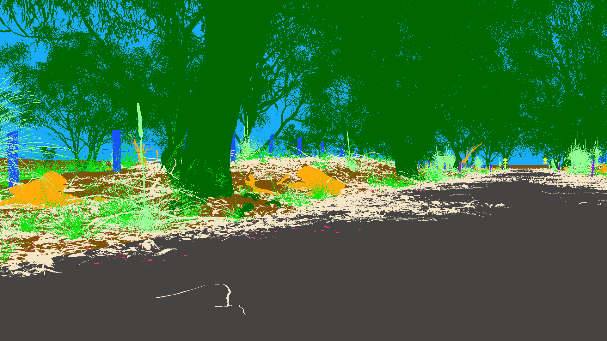
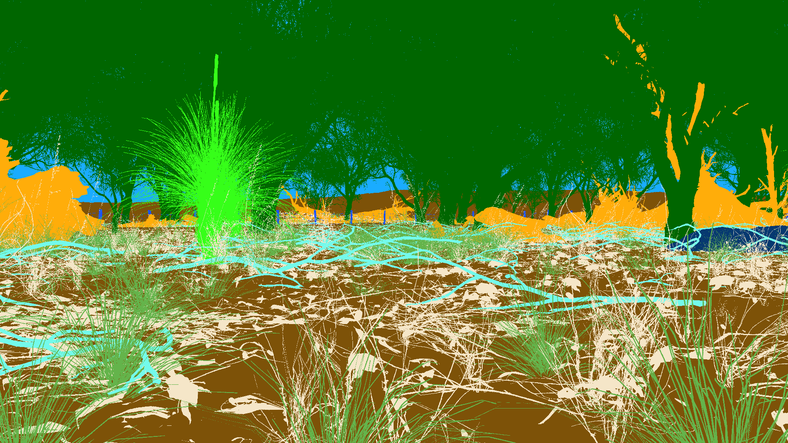

# OUTBACK: A Multimodal Synthetic Dataset for Rural Australian Off-road Robot Navigation

  **Liyana Wijayathunga** 1, **Dulitha Dabare** 1, **Alexander Rassau** 1, **Douglas Chai** 1, **Shamsul Islam** 2 
1 School of Engineering, Edith Cowan University, Perth, Australia
 2 School of Science, Edith Cowan University, Perth, Australia

# Introduction

One of the most important aspects of robot scene understanding is semantic segmentation of external environments. Urban environment semantic segmentation has been extensively investigated by researchers and many real-world and synthetic datasets have been utilised to develop highly accurate segmentation results. However, the number of off-road datasets available for robot navigation research remains limited.  To address this, we introduce a novel framework to generate varied photorealistic synthetic off-road datasets capable of supporting multiple sensor modalities. 

To evaluate this approach, a synthetic multimodal dataset for off-road ground robot navigation in typical Western Australian outback conditions has been created. The robot simulations for synthetic dataset generation were conducted using the NVIDIA Isaac Sim robotics simulator platform and the camera, LiDAR, and IMU sensor data was collected using two synthetic off-road environment models. After combining some of the semantic classes (Pole and Fence net as Fence, Horizon and Ground as Ground, Roots and Tree as Tree) introduced in our DICTA 2024 conference [paper](https://edithcowanuni-my.sharepoint.com/:f:/g/personal/lwijayat_our_ecu_edu_au/EvagmxpotyZDnwVRSSrZtYgBPA1sJ_oy_b0sznM7mc2cxg?e=jzvmKy)(https://ieeexplore.ieee.org/abstract/document/10869581) we make available our OUTBACK dataset, which consists of a total of 4,100 image frames with respective annotations covering 15 semantic classes. Experiments on the dataset were performed using three state-of-the-art image segmentation models. These experiments examine the effectiveness of urban semantic segmentation deep learning models on rural off-road driving scenarios and additionally evaluate the Sim2Real transfer of an off-road semantic segmentation model pretrained on our synthetic dataset. The following figures from the OUTBACK dataset represent an RGB monocular image (left) and the corresponding semantic annotation (right), respectively.
     
<!--|-------------------------|-------------------------|-->
<!--|||-->

# Simulation Setup
### Software
Unreal Engine 5 
NVIDIA Isaac Sim
### Robot Model
NVIDIA Carter v1
### Sensor Payload
RGB monocular camera  
LiDAR sensor 
IMU

# Dataset

You can download the annotated dataset at the following links

**RGB images** [Download](https://edithcowanuni-my.sharepoint.com/:f:/g/personal/lwijayat_our_ecu_edu_au/EvagmxpotyZDnwVRSSrZtYgBPA1sJ_oy_b0sznM7mc2cxg?e=jzvmKy)
 
**RGB image semantic annotations** [Download](https://edithcowanuni-my.sharepoint.com/:f:/g/personal/lwijayat_our_ecu_edu_au/EoGuNjvv7RFOn9HBkQ7s05kBomQcjA7gX3558gxofaaSlg?e=b9CdDG)
 
**IMU sensor data** [Download](https://edithcowanuni-my.sharepoint.com/:f:/g/personal/lwijayat_our_ecu_edu_au/En8SlygSZ3pBhu6o8G8HW9YB5X9ZEPaURTYEIX5ZOpAszg?e=0T2T4a)
 
**LiDAR depth data** [Download](https://edithcowanuni-my.sharepoint.com/:f:/g/personal/lwijayat_our_ecu_edu_au/Etb842pOLoVOhAeQVswoLv8BOIArLFnWES-yX-alDPOFVQ?e=wuq6lW)
 
**LiDAR semantic annotations** [Download](https://edithcowanuni-my.sharepoint.com/:f:/g/personal/lwijayat_our_ecu_edu_au/Et6_6MbN7htLvPgQC5gjY6IBXwA5OfuSKPdOHeiRdCkU0g?e=6npsHt)
 
**OUTBACK environment USD data** [Download](https://edithcowanuni-my.sharepoint.com/:u:/g/personal/lwijayat_our_ecu_edu_au/EWtOwhPlshBJq1sXdouPS-oBmxviyiGpeeAz2ipZqkMVrw?e=EHIveW)
 
**Python scripts** [Download](https://edithcowanuni-my.sharepoint.com/:f:/g/personal/lwijayat_our_ecu_edu_au/ElrFMjfdbD9Bkmzbyfq_n5MBy1tSk_MaE53NRmOO8nXxFw?e=59ryDv)
# License

This project is released under the [Apache 2.0 license](LICENSE).

# Acknowledgement
The Isaac Sim synthetic environments were primarily developed using Unreal Engine assets provided by the open-source asset pack available at the given link. [Unreal Engine asset pack](https://www.unrealengine.com/en-US/blog/rural-australia-environment-collection-now-available-for-free)  
The source code for experiments in OUTBACK is heavily based on [MMSegmentation](https://github.com/open-mmlab/mmsegmentation). 
